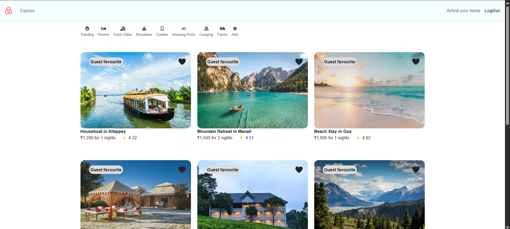

# 🏡Wanderland (Airbnb Clone) 

A full-stack **Airbnb Clone** web application built using **Node.js**, **Express**, **MongoDB Atlas**, and **Cloudinary**.
Users can sign up, log in, add their own property listings, and review other listings. Only the listing owner has permission to edit or delete their listings.

---

## 📸 Project Preview



---

## ✨ Features

* 🔐 User Authentication (Login / Signup)
* 🏠 Add your own home listing
* 📝 Add reviews on listings
* ✏️ Only owner can edit listing
* 🗑️ Only owner can delete listing
* ☁️ Image upload using Cloudinary
* 🌍 MongoDB Atlas database connection
* 🔒 Authorization & Access Control
* 📱 Responsive UI

---

## 🛠️ Tech Stack

### Frontend

* EJS
* Bootstrap
* CSS

### Backend

* Node.js
* Express.js

### Database

* MongoDB Atlas
* Mongoose

### Cloud Services

* Cloudinary (Image Upload)

### Authentication

* Passport.js
* Express-session

---

## 📂 Project Structure

```text
Wanderland/
│
├── models/
│   ├── listing.js
│   ├── review.js
│   └── user.js
│
├── routes/
│   ├── listing.js
│   ├── review.js
│   └── user.js
│
├── views/
│    ├── includes
│       └── flash.ejs
│       └── footer.ejs
│       └── navbar.ejs
│    ├── layouts
│        ├── boilerplate.ejs 
│   ├── listings/
│        ├── edit.ejs
│       ├── index.ejs
│       ├── new.ejs
│       ├── show.ejs
│   ├── users/
│        └── login.ejs
│       └── signpup.ejs
│   ├── error.ejs
│
├── public/
│   ├── css/
│   ├── js/
│
├── utils/
│   └── ExpressError.js
│   └── wrapAsync.js
├── middleware.js
├── index.js
├── package.json
├── .env
└── README.md
```

---

## ⚙️ Environment Variables

Create a `.env` file in root directory:

```
MONGO_URI=your_mongodb_atlas_url
CLOUD_NAME=your_cloudinary_name
CLOUD_API_KEY=your_cloudinary_key
CLOUD_API_SECRET=your_cloudinary_secret
SECRET=session_secret
```

---

## 📦 Installation & Setup

Clone the repository:

```
git clone https://github.com/Rsccpp/Wanderland.git
```

Navigate to project folder:

```
cd your_folerName
```

Install dependencies:

```
npm install
```

Run the server:

```
node index.js
```

Open browser:

```
http://localhost:3000
```

---

## 🔐 Authorization Rules

* Only logged-in users can create listings
* Only listing owner can edit/delete
* Only logged-in users can add reviews
* Reviews linked to user accounts

---

## 🌟 Future Improvements

* Wishlist feature
* Booking system
* Payment integration
* Map integration
* User profile page

---

## 🤝 Contributing

Contributions are welcome! Feel free to submit issues and pull requests.

---

## 📧 Contact

Created with ❤️ by **Rohit Singh**
